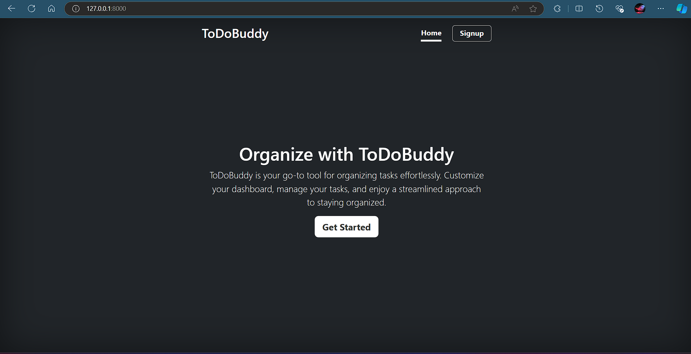
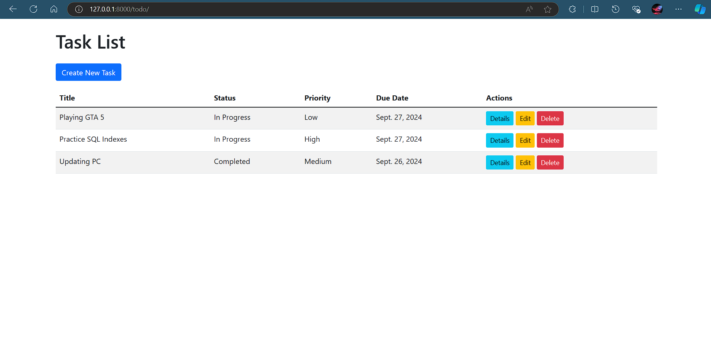
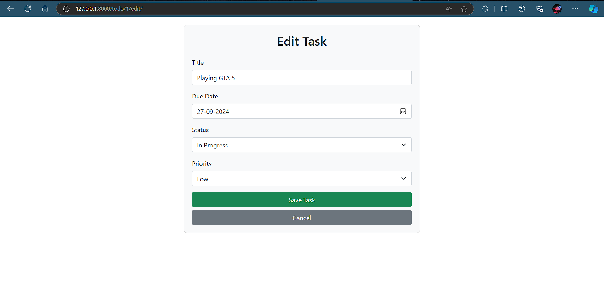
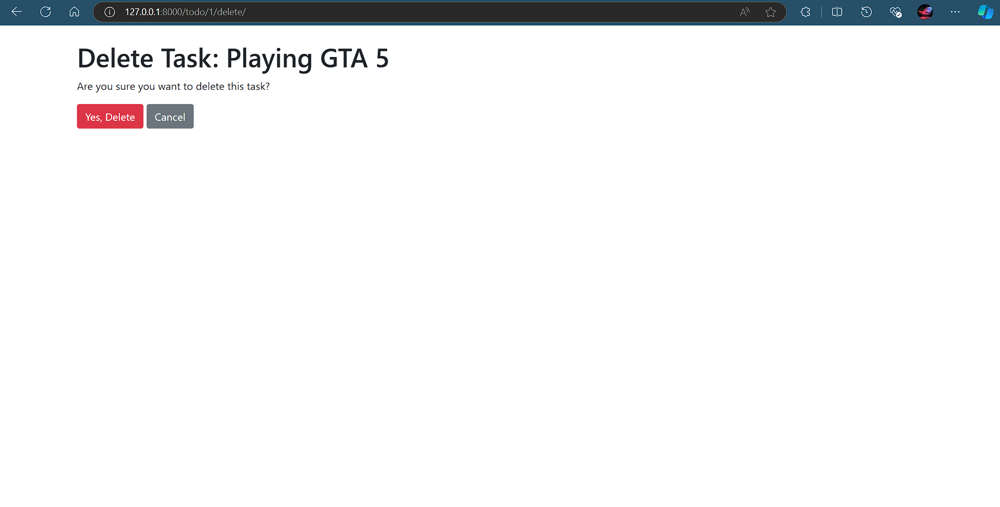

# TodoBuddy


TodoBuddy is a simple and intuitive Todo Application built with Django. This project was created as a learning exercise and will be continuously improved as I advance my skills.

## Table of Contents

- [Introduction](#introduction)
- [Features](#features)
- [Installation](#installation)
- [Usage](#usage)
- [Screenshots](#screenshots)
- [Contributing](#contributing)
- [License](#license)
- [Contact](#contact)

## Introduction

TodoBuddy is designed to help you manage your tasks efficiently. Whether you need to keep track of your daily chores or manage a complex project, TodoBuddy has got you covered.

## Features

- Add, edit, and delete tasks
- Mark tasks as complete or incomplete
- View task details
- User-friendly interface

## Installation

To get started with TodoBuddy, follow these steps:

1. **Clone the repository:**
    ```bash
    git clone https://github.com/CodeWithMayank-Py/Todo-App.git
    cd myapp
    ```

2. **Create a virtual environment:**
    ```bash
    python3 -m venv venv
    source venv/bin/activate  # On Windows use `venv\Scripts\activate`
    ```

3. **Install dependencies:**
    ```bash
    pip install -r requirements.txt
    ```

4. **Apply migrations:**
    ```bash
    python manage.py migrate
    ```

5. **Run the development server:**
    ```bash
    python manage.py runserver
    ```

6. **Access the application:**
    Open your browser and go to `http://127.0.0.1:8000/`

## Usage

Once the server is running, you can start using TodoBuddy to manage your tasks. The main functionalities include:

- **Home:** The landing page of TodoBuddy, displaying the application name and a brief introduction.
- **Task List:** View all your tasks.
- **Task Detail:** View details of a specific task.
- **Task Edit:** Edit an existing task.
- **Task Delete:** Delete a task.

## Screenshots

### Home Page


### Task List Page


### Task Detail Page


### Task Edit Page


### Task Delete Page


## Contributing

Contributions are welcome! If you have any ideas, suggestions, or bug reports, please open an issue or submit a pull request.

1. **Fork the repository**
2. **Create a new branch**
    ```bash
    git checkout -b feature/your-feature-name
    ```
3. **Commit your changes**
    ```bash
    git commit -m "Add your commit message"
    ```
4. **Push to the branch**
    ```bash
    git push origin feature/your-feature-name
    ```
5. **Open a pull request**

## License

This project is licensed under the MIT License. See the [LICENSE](LICENSE) file for details.

## Contact

If you have any questions or feedback, feel free to reach out:

- **Email:** paliwalm4321@gmail.com
- **GitHub:** [CodeWithMayank-Py](https://github.com/CodeWithMayank-Py)

---

Thank you for using TodoBuddy! Happy task managing!